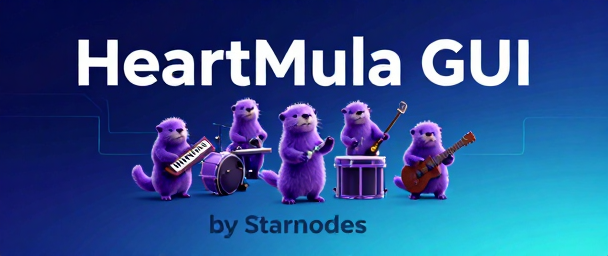

# HeartMuLaGUI - Windows Music Generation Interface

<p align="center">
    
</p>

<p align="center">
    <strong>Easy-to-use Windows GUI for HeartMuLa Music Generation</strong><br>
    Fast Setup • Auto Model Download • User-Friendly Interface • FP8 Optimization
</p>

<p align="center">
    <a href="#-quick-start">Quick Start</a> •
    <a href="#-features">Features</a> •
    <a href="#-installation">Installation</a> •
    <a href="#-usage">Usage</a> •
    <a href="#-links">Links</a>
</p>

---

## 🎵 About

**HeartMuLaGUI** is a user-friendly Windows application that provides a graphical interface for the [HeartMuLa](https://github.com/HeartMuLa/heartlib) music generation AI. Generate high-quality music with lyrics, tags, and customizable parameters - all through an intuitive GUI.

Built on top of the powerful **HeartMuLa** music foundation models, this GUI makes AI music generation accessible to everyone on Windows.

### What is HeartMuLa?

HeartMuLa is a family of open-source music foundation models that includes:
- **HeartMuLa**: Music language model with multilingual lyrics support
- **HeartCodec**: High-fidelity 12.5 Hz music codec
- **HeartTranscriptor**: Whisper-based lyrics transcription
- **HeartCLAP**: Audio-text alignment model

---

## ✨ Features

### 🖥️ **Easy-to-Use Interface**
- **Tag Selection**: 40+ musical tags with checkboxes (instruments, moods, genres)
- **Lyrics Editor**: Multi-line editor with song structure support (`[Verse]`, `[Chorus]`, etc.)
- **Real-time Parameters**: Adjust temperature, top-k, CFG scale, and audio length
- **Status Logging**: Track generation progress and model status
- **Batch Processing**: Queue multiple songs and generate them sequentially

### ⚡ **Performance Optimized for Windows**
- **FP8 Quantization**: Reduces VRAM usage by ~50% (6-7 GB → 3-4 GB)
- **8GB VRAM Support**: Optimized for consumer GPUs
- **Fast Generation**: Real-time factor ~1.0 (30s audio = 30s generation)
- **Auto Model Loading**: Optional automatic model loading on startup

### 🎼 **Music Generation**
- **Single Generation**: Create music instantly with current settings
- **Batch Queue**: Add multiple songs with different configurations
- **Custom Output**: Name your files with automatic timestamps
- **MP3 Export**: High-quality 48kHz MP3 output
- **Multilingual Support**: English, Chinese, Japanese, Korean, Spanish lyrics

### 🚀 **Windows-Specific Features**
- **One-Click Setup**: `01_SETUP_GUI.bat` handles everything
- **Auto Model Download**: Optional automatic model downloading during setup
- **Easy Launch**: `02_START_GUI.bat` starts the GUI instantly
- **No Command Line Needed**: Everything accessible through the GUI

---

## 🚀 Quick Start

### Prerequisites
- **Windows 10/11** (64-bit)
- **NVIDIA GPU** with 8GB+ VRAM (CUDA support)
- **20GB free disk space** (15GB for models)
- **Internet connection** (for model download)

### Installation (5 minutes + model download)

#### Step 1: Setup
Double-click `01_SETUP_GUI.bat` or run:
```bash
01_SETUP_GUI.bat
```

This will:
- Create Python 3.10 virtual environment
- Install CUDA-enabled PyTorch
- Install all dependencies
- Ask if you want to download models automatically (~10-12 GB)

#### Step 2: Download Models (if not done during setup)
If you skipped automatic download, run:
```bash
download_models.bat
```

Or download manually using Hugging Face CLI:
```bash
hf download --local-dir './ckpt' 'HeartMuLa/HeartMuLaGen'
hf download --local-dir './ckpt/HeartMuLa-oss-3B' 'HeartMuLa/HeartMuLa-oss-3B'
hf download --local-dir './ckpt/HeartCodec-oss' 'HeartMuLa/HeartCodec-oss'
```

#### Step 3: Launch
Double-click `02_START_GUI.bat` or run:
```bash
02_START_GUI.bat
```

#### Step 4: Generate Your First Song
1. Go to **Settings** tab → Click **"Load Model"** (wait 2-5 minutes)
2. Go to **Generation** tab → Select tags (e.g., `piano`, `happy`, `pop`)
3. Enter lyrics with structure markers:
   ```
   [Verse]
   Your lyrics here
   
   [Chorus]
   Chorus lyrics here
   ```
4. Click **"Generate Now"**
5. Find your MP3 in `./output/` folder!

---

## 📖 Installation

### System Requirements

**Minimum:**
- Windows 10/11 (64-bit)
- NVIDIA GPU with 8GB VRAM
- 20GB free disk space
- Internet connection

**Recommended:**
- Windows 11
- NVIDIA GPU with 12GB+ VRAM
- 30GB free disk space
- Fast internet for model download

### Detailed Setup

1. **Download or clone this repository**
   ```bash
   git clone https://github.com/Starnodes2024/HeartMuLaGUI.git
   cd HeartMuLaGUI
   ```

2. **Run the setup script**
   ```bash
   01_SETUP_GUI.bat
   ```
   
   The setup script will:
   - Check for Python 3.10
   - Create virtual environment
   - Install PyTorch with CUDA 12.1
   - Install HeartMuLa library
   - Install GUI dependencies
   - Optionally download models

3. **Verify installation (optional)**
   ```bash
   venv\Scripts\activate
   python verify_installation.py
   ```

4. **Launch the GUI**
   ```bash
   02_START_GUI.bat
   ```

### Troubleshooting Setup

**"Torch not compiled with CUDA enabled" error:**
```bash
fix_cuda_issue.bat
```

**Models not downloading:**
- Check internet connection
- Try manual download with `download_models.bat`
- See `03_IMPORTANT_MODEL_DOWNLOAD.txt` for alternative methods

For more help, see [TROUBLESHOOTING.md](TROUBLESHOOTING.md)

---

## 🎹 Usage

### First Time Setup

1. Launch the application using `02_START_GUI.bat`
2. Go to **Settings** tab
3. Configure paths (defaults are usually fine):
   - Model Path: `./ckpt`
   - Output Folder: `./output`
4. **(Recommended for 8GB VRAM)** Enable **FP8 Quantization**
5. Click **"Load Model"** - this takes 2-5 minutes
6. Wait for **"Model: Loaded"** status (green indicator)

### Generating Music

#### Music Generation Tab

1. **Select Tags** - Choose 3-5 tags for best results:
   - Instruments: `piano`, `guitar`, `drums`, `saxophone`, etc.
   - Moods: `happy`, `sad`, `romantic`, `energetic`, etc.
   - Genres: `pop`, `rock`, `jazz`, `ballad`, etc.

2. **Enter Lyrics** - Use song structure markers:
   ```
   [Intro]
   
   [Verse]
   Walking down the street
   Feeling the beat
   
   [Chorus]
   This is my song
   Singing all day long
   
   [Outro]
   ```

3. **Set Parameters**:
   - **Max Audio Length**: 30000 ms (30 seconds) recommended for 8GB VRAM
   - **Top-K**: 50 (default) - controls creativity
   - **Temperature**: 1.0 (default) - controls randomness
   - **CFG Scale**: 1.5 (default) - controls tag adherence
   - **Output Filename**: Your desired filename (timestamp added automatically)

4. **Generate**:
   - **Generate Now**: Create immediately
   - **Add to Batch**: Queue for later batch processing

### Batch Processing

1. Add multiple songs from the Generation tab using **"Add to Batch"**
2. Go to **Batch Queue** tab
3. Review your queue
4. Click **"Start Batch Processing"**
5. Monitor progress bar and status log
6. All files saved to output folder with timestamps

### Settings & Optimization

#### For 8GB VRAM Systems:
✅ Enable **FP8 Quantization** in Settings  
✅ Use `bfloat16` data type  
✅ Keep audio length ≤ 60 seconds  
✅ Close other GPU applications  

#### Performance Tips:
- **FP8 Quantization**: 50% less VRAM, 20% faster generation
- **First generation is slower**: Model warmup takes time
- **Normal speed**: RTF ≈ 1.0 (30s audio = 30s generation)
- **With FP8**: RTF ≈ 0.8 (20-30% faster)

---

## 🎼 GUI Functions

### Tabs Overview

#### 1. **Music Generation**
- Tag selection with 40+ checkboxes
- Lyrics editor with syntax highlighting
- Parameter controls with tooltips
- Generate Now / Add to Batch buttons
- Selected tags display

#### 2. **Batch Queue**
- View all queued songs
- Remove selected items
- Clear entire queue
- Start batch processing
- Progress tracking

#### 3. **Settings**
- Model path configuration
- Output folder selection
- Model version selection (3B/7B)
- Device selection (CUDA/CPU)
- Data type selection (bfloat16/float16/float32)
- FP8 Quantization toggle
- Auto-load model option
- Timestamp option
- Load Model button
- Save Settings button

#### 4. **Info** *(New!)*
- Links to HeartMuLaGUI GitHub
- Links to original HeartMuLa GitHub
- Discord community link
- Documentation links
- License information
- Version information

### Status Bar
- Model loading status
- Generation progress
- Current operation
- Error messages
- File save confirmations

---

## 📚 Documentation

- **[QUICK_START.md](QUICK_START.md)** - Fast setup guide
- **[GUI_USER_GUIDE.md](GUI_USER_GUIDE.md)** - Detailed usage instructions
- **[FP8_OPTIMIZATION_GUIDE.md](FP8_OPTIMIZATION_GUIDE.md)** - Performance optimization
- **[TROUBLESHOOTING.md](TROUBLESHOOTING.md)** - Common issues and solutions
- **[README-HEARTLIB.md](README-HEARTLIB.md)** - Original HeartMuLa documentation

---

## 🔗 Links

### HeartMuLaGUI (This Project)
- **GitHub**: [https://github.com/Starnodes2024/HeartMuLaGUI](https://github.com/Starnodes2024/HeartMuLaGUI)
- **Issues**: Report bugs and request features
- **Discussions**: Community support and ideas

### Original HeartMuLa Project
- **GitHub**: [https://github.com/HeartMuLa/heartlib](https://github.com/HeartMuLa/heartlib)
- **Paper**: [ArXiv 2601.10547](https://arxiv.org/abs/2601.10547)
- **Demo**: [https://heartmula.github.io/](https://heartmula.github.io/)
- **Models**: [Hugging Face](https://huggingface.co/HeartMuLa) | [ModelScope](https://modelscope.cn/models/HeartMuLa)

### Community
- **Discord**: [https://discord.gg/BKXF5FgH](https://discord.gg/BKXF5FgH)
- **Email**: heartmula.ai@gmail.com

---

## ⚖️ License

This project is licensed under the **Apache License 2.0** - see the [LICENSE](LICENSE) file for details.

### Attribution

HeartMuLaGUI is a derivative work based on [HeartMuLa/heartlib](https://github.com/HeartMuLa/heartlib).

**Please credit both:**
- **HeartMuLa Team** - Original music generation library
- **HeartMuLaGUI Contributors** - Windows GUI application

See [LICENSE-ORIGINAL](LICENSE-ORIGINAL) for the original HeartMuLa license.

### Components

1. **Original HeartMuLa Library** (Apache 2.0):
   - HeartMuLa music generation models
   - HeartCodec audio codec
   - HeartTranscriptor lyrics transcription
   - HeartCLAP audio-text alignment

2. **GUI Application** (Apache 2.0):
   - Windows graphical interface
   - Setup and launcher scripts
   - FP8 optimization tools
   - Documentation and guides

---

## 🙏 Acknowledgments

- **HeartMuLa Team** - For creating the amazing HeartMuLa music foundation models
- **Original Paper**: Yang et al., "HeartMuLa: A Family of Open Sourced Music Foundation Models" (2026)
- **Community Contributors** - For testing, feedback, and improvements

---

## 📬 Support

### Getting Help

- **Documentation**: Check the docs folder for detailed guides
- **Troubleshooting**: See [TROUBLESHOOTING.md](TROUBLESHOOTING.md)
- **GitHub Issues**: Report bugs or request features at [https://github.com/Starnodes2024/HeartMuLaGUI](https://github.com/Starnodes2024/HeartMuLaGUI)

### Common Issues

**Model won't load:**
- Verify `./ckpt` folder contains all required files
- Check CUDA availability: `python -c "import torch; print(torch.cuda.is_available())"`
- Try CPU mode in Settings (slower but more compatible)

**Out of memory:**
- Enable FP8 Quantization in Settings
- Reduce max audio length to 30 seconds
- Close other GPU applications

**Slow generation:**
- This is normal (RTF ≈ 1.0)
- Enable FP8 for 20-30% speedup
- First generation is slower due to warmup

---

## 🎯 Popular Tag Combinations

**Romantic Ballad:**  
`piano,romantic,ballad,slow,emotional`

**Upbeat Pop:**  
`synthesizer,happy,pop,energetic,dance`

**Chill Jazz:**  
`saxophone,jazz,calm,relaxing,smooth`

**Rock Energy:**  
`guitar,drums,rock,energetic,electric`

**K-Pop:**  
`kpop,happy,dance,energetic,synthesizer`

---

## 📊 Project Status

- ✅ **Stable Release** - Ready for production use
- ✅ **Windows 10/11** - Fully tested and supported
- ✅ **8GB VRAM** - Optimized with FP8 quantization
- ✅ **Easy Setup** - One-click installation
- ✅ **Auto Model Download** - Integrated model downloading
- ✅ **Batch Processing** - Queue multiple songs
- ✅ **User-Friendly GUI** - No command line required

---

## 🔮 Future Enhancements

- Streaming inference for longer audio
- Parallel batch processing
- Audio preview before saving
- Preset management for common configurations
- Reference audio conditioning (when available in HeartMuLa)
- Export to additional formats (WAV, FLAC)
- Advanced parameter presets

---

<p align="center">
    Made with ❤️ for the music generation community<br>
    Based on <a href="https://github.com/HeartMuLa/heartlib">HeartMuLa</a> by the HeartMuLa Team
</p>

<p align="center">
    <a href="#-quick-start">Quick Start</a> •
    <a href="#-features">Features</a> •
    <a href="#-installation">Installation</a> •
    <a href="#-usage">Usage</a> •
    <a href="#-links">Links</a>
</p>
